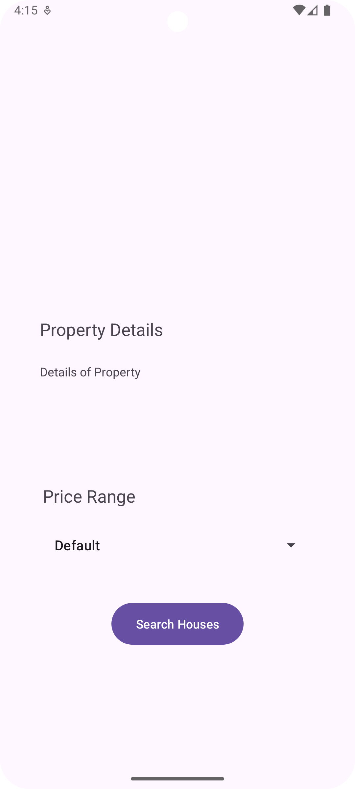
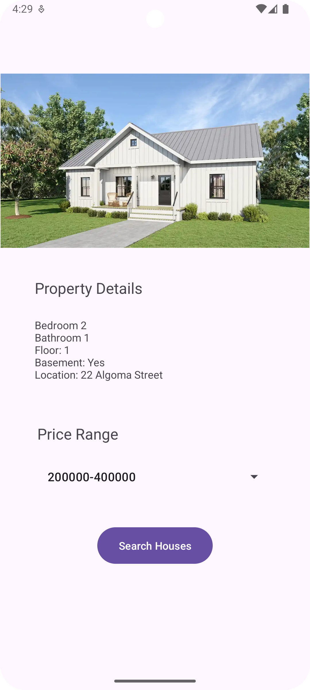

# Assignment1
Assignment 1 for Mobile Programming

For this assignment, I have created an application which uses different views, buttons and spinners. This application allows to view different houses with their property details based on the price. The user can select different prices from the spinner options and based on the selection, the application will show the image as well as the property of the house.

## Default Page

## First Selection

## Second Selection

## Third Selection
